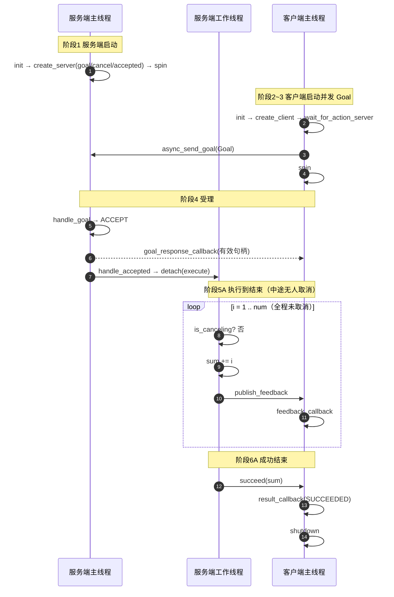
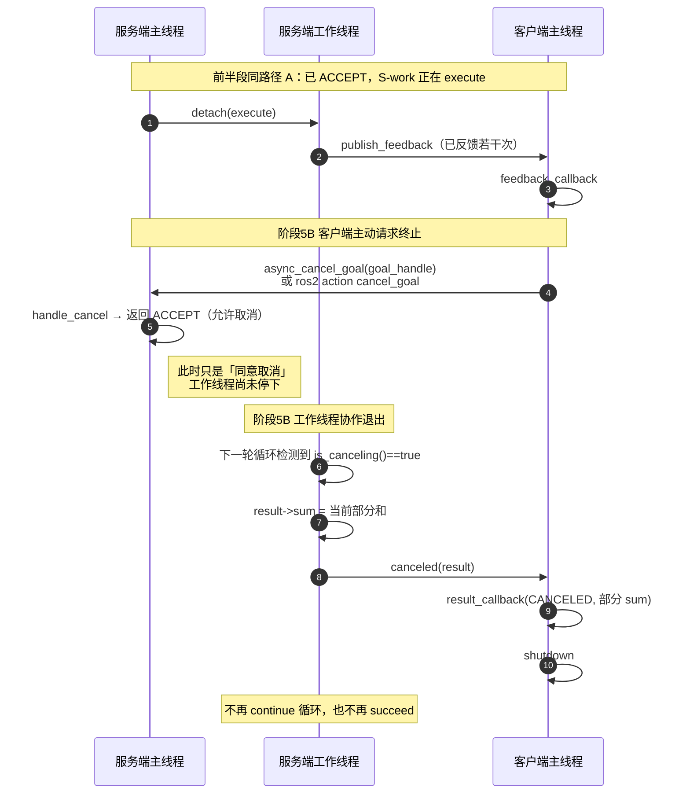

# Progress Action 从 0 到 1：完整调用过程

> API / 依赖 / 类型详解见同目录：[`Action_API与模块详解.md`](./Action_API与模块详解.md)

对应代码：

- 接口：`base_interfaces_demo/action/Progress.action`
- 服务端：`demo01_action_server.cpp`（已实现取消）
- 客户端：`demo02_action_client.cpp`（已处理 `CANCELED` 结果；主动取消可用命令行或自行调 API）
- 动作名：`get_sum`（两端必须相同）

运行：

```bash
# 终端 1
ros2 run cpp03_action demo01_action_server

# 终端 2：正常跑完
ros2 run cpp03_action demo02_action_client 100

# 另开终端：执行中主动取消（见阶段 5B）
ros2 action send_goal /get_sum base_interfaces_demo/action/Progress "{num: 200}"
# 再开一个终端取消（把 <goal-id> 换成上一条输出的 Goal ID）
ros2 action cancel_goal /get_sum <goal-id>
```

Action 相对 Service 的关键能力之一：**任务执行到一半，客户端可以主动请求终止（Cancel）**。

---

## 0. 接口长什么样

| 段 | 字段 | 谁填 | 含义 |
|----|------|------|------|
| Goal | `num` | 客户端 | 要累加到几 |
| Result | `sum` | 服务端 | 最终和；**取消时也可带回已算出的部分和** |
| Feedback | `progress` | 服务端 | 进度 `0.0 ~ 1.0` |

三种结束方式（客户端 `result_callback` 里都能看到）：

| 结束方式 | 服务端调用 | 客户端 `result.code` |
|----------|------------|----------------------|
| 正常完成 | `succeed(result)` | `SUCCEEDED` |
| **主动取消** | `canceled(result)` | `CANCELED` |
| 异常中止 | `abort(result)` | `ABORTED` |

---

## 1. 完整时序：正常跑完（路径 A）



---

## 2. 完整时序：执行中主动取消（路径 B，重点）

取消是 **客户端主动发起**，不是服务端自己停。  
服务端用**协作式取消**：先 `handle_cancel` 同意，工作线程下一次循环看到 `is_canceling()` 再自己收尾——**不是强杀线程**。



和路径 A 的差别只在后半段：

| | 路径 A 正常完成 | 路径 B 主动取消 |
|--|-----------------|-----------------|
| 谁先开口 | 工作线程算完 | **客户端先发 cancel** |
| 服务端主线程 | 不经过 `handle_cancel` | 先走 `handle_cancel` |
| 工作线程出口 | `succeed` | `canceled` |
| 客户端结果码 | `SUCCEEDED` | `CANCELED` |
| Result.sum | 完整累加和 | **已算到的部分和**（本 demo） |

---

## 3. 阶段拆解

### 阶段 1：服务端启动时为何要注册 `handle_cancel`

```cpp
create_server<Progress>(
  this, "get_sum",
  handle_goal,      // 接不接这个任务
  handle_cancel,    // ← 允许不允许「中途终止」
  handle_accepted); // 接了之后怎么执行
```

本 demo 的取消策略：

```cpp
CancelResponse handle_cancel(...)
{
  // 一律允许客户端取消
  return rclcpp_action::CancelResponse::ACCEPT;
}
```

若这里返回 `REJECT`，客户端取消请求会被拒，任务继续跑到 `succeed` 或自己 abort。

---

### 阶段 2~4：启动、发现、发 Goal、受理

与原先相同，摘要：

1. 服务端 `spin` 常驻  
2. 客户端 `wait_for_action_server` → `async_send_goal` → `spin`  
3. `handle_goal`：`num<=1` 拒绝；否则 ACCEPT  
4. `handle_accepted` 里 `detach(execute)` 开工作线程  

客户端 `goal_response_callback` 拿到的**非空句柄**，就是以后用来取消的钥匙：

```text
goal_handle ≠ nullptr
  → 可 async_cancel_goal(goal_handle)
  → 也可被 ros2 action cancel_goal 按 Goal ID 取消
```

---

### 阶段 5A：正常执行 + 反馈

```text
for i = 1 .. num:
    if is_canceling(): → 走取消收尾（5B）
    sum += i
    publish_feedback(progress)
    sleep 100ms
succeed(sum)
```

每 `publish_feedback` 一次 → 客户端 `feedback_callback` 一次。

---

### 阶段 5B：主动终止（Cancel）怎么走通

**① 客户端发起（两种常用方式）**

代码里（需自己保存 `goal_response_callback` 拿到的句柄）：

```cpp
action_client_->async_cancel_goal(goal_handle);
```

命令行（本仓库客户端没写取消按钮时，用这个验证最方便）：

```bash
ros2 action cancel_goal /get_sum <goal-id>
# 或取消该 action 下所有目标：
ros2 action cancel_goal /get_sum
```

**② 服务端主线程：先决定允不允许**

```text
收到取消请求
  → handle_cancel
  → ACCEPT：标记该 Goal「正在取消」
  → REJECT：任务继续，客户端取消失败
```

**③ 服务端工作线程：自己检查、自己收尾**

```cpp
if (goal_handle->is_canceling()) {
  result->sum = sum;           // 部分结果仍可带回
  goal_handle->canceled(result);
  return;                      // 结束 execute，不再 succeed
}
```

所以：

- **Cancel 不是立刻 `pthread_kill`**
- 要等工作线程跑到检查点（本例是每轮循环开头）才会停
- 这就是为什么耗时逻辑必须放工作线程，且主线程要继续 `spin`：否则 `handle_cancel` 都进不来

**④ 客户端收终态**

```cpp
case ResultCode::CANCELED:
  // 打印部分 sum，然后 shutdown
```

---

### 阶段 6：三种收尾对照

| API | 含义 | 客户端 |
|-----|------|--------|
| `succeed(result)` | 正常算完 | `SUCCEEDED` |
| `canceled(result)` | 客户端取消且服务端同意后收尾 | `CANCELED` |
| `abort(result)` | 服务端主动宣布失败（本 demo 未用） | `ABORTED` |

---

### 阶段 7：进程退出

| 进程 | 行为 |
|------|------|
| 客户端 | `result_callback`（成功或取消）里 `shutdown` → 退出 |
| 服务端 | 继续 `spin`，可接下一个 Goal |

---

## 4. 线程关系（取消为何依赖双线程）

```text
服务端
├── 主线程 spin
│     handle_goal      —— 接不接
│     handle_cancel    —— 允不允许终止   ← 取消请求打在这里
│     handle_accepted  —— 启动 S-work
└── 工作线程 execute
      循环检查 is_canceling()           ← 真正停下在这里
      publish_feedback / succeed|canceled

客户端
└── 主线程 spin
      goal_response_callback  —— 拿到句柄（取消要用）
      feedback_callback
      发起 async_cancel_goal            ← 主动终止从这里开口
      result_callback(SUCCEEDED|CANCELED)
```

若把整个 `execute` 写在 `handle_accepted` 里死循环、不 `detach`：主线程被堵死 → **`handle_cancel` 无法被调度 → 客户端取消无效**。

---

## 5. 三条路径对照

**A. 正常完成**

```text
send_goal → ACCEPT → feedback×N → succeed → SUCCEEDED
```

**B. 主动取消（Action 特色）**

```text
send_goal → ACCEPT → feedback×若干
→ 客户端 cancel → handle_cancel(ACCEPT)
→ 工作线程 is_canceling → canceled(部分sum) → CANCELED
```

**C. 一开始就拒绝**

```text
send_goal → handle_goal(REJECT) → goal_response(空) → 无反馈、无取消、无 result
```

---

## 6. 必须记住的 5 句话

1. **两端都要 `create_*` + `spin`，回调才会跑。**
2. **三个 `bind` 是注册；只有 `detach(execute)` 才是工作线程。**
3. **`async_send_goal` 只负责发出 Goal；进度靠 feedback，结局靠 result。**
4. **主动终止 = 客户端 `cancel` → 服务端 `handle_cancel` 同意 → 工作线程见 `is_canceling` 后 `canceled`；是协作停止，不是强杀。**
5. **Cancel 是 Action 相对普通 Service 的核心能力之一；本服务端已支持，可用 `ros2 action cancel_goal` 验证。**
