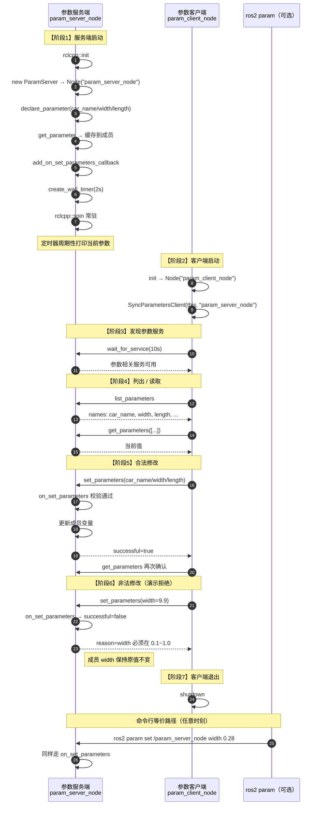

# 参数服务 从 0 到 1：完整调用过程

> 对应课程：**2.5.3 参数服务 (C++)**  
> API 详解见同目录：[`Param_API与模块详解.md`](./Param_API与模块详解.md)

对应代码：

| 文件 | 作用 |
|------|------|
| `demo00_param.cpp` | **单节点**把「增删改查」跑通（入门，跑完就退出） |
| `demo01_param_server.cpp` | 服务端：增删改查 + 常驻 spin，供远端操作 |
| `demo02_param_client.cpp` | 客户端：远程查 / 改 |

目标节点名（服务端）：`param_server_node`

运行：

```bash
# 入门：只看本节点增删改查日志
ros2 run cpp04_param demo00_param

# 完整：服务端常驻 + 客户端远程改
ros2 run cpp04_param demo01_param_server
ros2 run cpp04_param demo02_param_client

# 命令行等价操作
ros2 param list
ros2 param get /param_server_node car_name
ros2 param set /param_server_node width 0.30
```

---

## 0. 先记住课件里的四步：增删改查

| 步骤 | 中文 | API | 含义 |
|------|------|-----|------|
| 3-1 | **增** | `declare_parameter` | 在本节点登记参数（名/类型/默认值） |
| 3-2 | **查** | `get_parameter` / `has_parameter` / `list_parameters` | 读当前值或是否存在 |
| 3-3 | **改** | `set_parameter` / `set_parameters` | 改值；远端改会进 `on_set_parameters` |
| 3-4 | **删** | `undeclare_parameter` | 从本节点参数表移除 |

构造节点时课件常见选项：

```cpp
Node("param_server_node",
     rclcpp::NodeOptions().allow_undeclared_parameters(true));
```

| 选项 | 作用 |
|------|------|
| `allow_undeclared_parameters(true)` | 允许对**尚未 declare** 的名字直接 `set`（会自动声明） |
| 默认 `false` | 未声明就 set 通常失败，更严格、更适合正式项目 |

注意：有的旧课件写成 `NodeOptions().all()`，在当前 ROS 2（Jazzy）里应使用上面的 `allow_undeclared_parameters(true)`。

---

## 0.1 参数服务是什么

和 Topic / Service / Action 不同：

| | Topic | Service | Action | **参数 (Param)** |
|--|-------|---------|--------|------------------|
| 目的 | 流式数据 | 一次请求应答 | 长任务+反馈+取消 | **节点配置项的读写** |
| 谁持有数据 | 发布端发出即走 | 算完就返回 | Goal/Result | **参数在某个 Node 上长期存放** |
| 典型操作 | publish / subscribe | call | send_goal | **增删改查** declare/get/set/undeclare |

一句话：

> 每个 Node 自带一套「参数服务」；本节点 `declare_parameter` 后，本进程或其它节点（`SyncParametersClient` / `ros2 param`）都能 list / get / set。

底层其实也是 ROS 服务（`~/get_parameters` 等），但业务上用 Param API，不必手写 srv。

本 demo 长期保留的参数：

| 名 | 类型 | 默认 | 校验 |
|----|------|------|------|
| `car_name` | string | `"turtle"` | 非空 |
| `width` | double | `0.25` | `0.1 ~ 1.0` |
| `length` | double | `0.45` | `0.1 ~ 2.0` |

---

## 1. 完整时序（从启动到客户端改参）



---

## 2. 阶段拆解

### 阶段 1：服务端从 0 起来

1. `rclcpp::init`
2. 创建 `ParamServer` 节点 `param_server_node`
3. **`declare_parameter`**：登记名字、类型、默认值  
   - 不声明 → 外部 get/set 会失败或行为不符合预期
4. `get_parameter(...).as_*()` 读到成员变量
5. `add_on_set_parameters_callback`：之后任何 set（客户端或 CLI）先过这里
6. 定时器每 2s 打印，方便肉眼看改参是否生效
7. `spin` 常驻（参数服务回调 + 定时器都靠它）

### 阶段 2~3：客户端连接

```cpp
param_client_ = std::make_shared<rclcpp::SyncParametersClient>(
  this, "param_server_node");  // 远端节点名！
param_client_->wait_for_service(10s);
```

`SyncParametersClient` = 同步封装：调用时内部等待结果，写演示代码更简单。  
（还有 `AsyncParametersClient`，适合长期节点里不阻塞。）

### 阶段 4：list / get

- `list_parameters({}, 0)`：列出远端参数名  
- `get_parameters({"car_name","width","length"})`：批量取值

### 阶段 5：合法 set

客户端构造 `rclcpp::Parameter("width", 0.30)` 等，调用 `set_parameters`。  
服务端 `on_set_parameters`：

- 校验通过 → `successful=true`，更新 `car_name_/width_/length_`
- 随后定时器打印会看到新值

### 阶段 6：非法 set（Action 里的「拒绝」同类思想）

`width=9.9` 越界 → 回调返回 `successful=false` + `reason`。  
**参数不会被改掉**；客户端打印「预期中的拒绝」。

### 阶段 7：退出

- 客户端：演示完 `shutdown` 退出  
- 服务端：继续 `spin`，仍可用 `ros2 param` 操作

---

## 3. 和「普通 Service」对照

| | `cpp02_service` AddInts | `cpp04_param` |
|--|-------------------------|---------------|
| 数据寿命 | 请求来一次算一次 | 参数一直挂在节点上 |
| 自定义 srv | 要写 `AddInts.srv` | 用标准参数接口，无需自定义 srv |
| 典型 API | `create_service` / `async_send_request` | `declare_parameter` / `SyncParametersClient` |
| 校验点 | 服务回调里 | `on_set_parameters` |

---

## 4. 多 Node 读写会不会有竞态？

会碰到两类问题，先分清：

| 类型 | 含义 | 本 demo（单线程 `spin`） |
|------|------|--------------------------|
| **内存数据竞争** | 两个线程同时读写同一成员变量 | 一般**没有**：定时器、`on_set_parameters`、参数服务回调都在同一条 executor 队列里**串行**执行 |
| **业务/语义竞态** | 多个客户端交错 get/set，结果取决于谁后到 | **会有**：后写覆盖先写（last-write-wins） |

### 4.1 参数存在哪、谁在抢

- 参数**只属于持有它的那一个 Node**（本例 `param_server_node`）。
- 多个 `SyncParametersClient` / 多个 `ros2 param set`，都是在调**同一个**节点上的 get/set 服务，并不是每人本地各改一份。
- 对端节点用单线程 `rclcpp::spin` 时，这些请求进入同一队列，**一次处理一个**，因此 `on_set_parameters` 与定时器打印通常不会并行踩同一块内存。

### 4.2 仍然要注意的语义竞态

1. **多客户端同时改同一参数**  
   A、B 都先 `get` 再基于旧值 `set` → 后成功的那次覆盖先成功的那次，没有自动合并或事务。

2. **校验拒绝不等于「排队重试」**  
   非法 `set`（如 `width=9.9`）在 `on_set_parameters` 里 `successful=false`，当前值不变；其它客户端的合法 `set` 仍按到达顺序生效。

3. **缓存成员 vs 节点权威值**  
   本 demo 定时器读的是回调里更新的 `width_` 等成员。单线程下与回调串行，一致。  
   若改成 `MultiThreadedExecutor`，回调和定时器可能并行 → 要对成员加锁，或每次打印改用 `get_parameter` 读节点内权威值。

4. **跨节点「配置权」**  
   若业务上只允许一个配置节点写参，需要自己约定（例如只有 supervisor 调 `set`，其它节点只读），参数 API 本身不提供分布式锁。

### 4.3 实践建议（写进习惯）

- 学习 / 多数节点：默认 **单线程 executor**，简单安全。
- 多写者：接受 last-write-wins，或集中到单一写者；需要时加版本号/时间戳参数自行检测覆盖。
- 多线程 executor：保护自有缓存，或不要缓存、读时再 `get_parameter`。
- 关键配置用 `declare` + `on_set_parameters` 校验；运行时热更新要想清楚「谁有权 set」。

### 4.4 和本 demo 的对应关系

```text
demo01_param_server  --spin 单线程--> 串行处理 set / 定时器  → 无明显内存竞态
demo02_param_client  --set--> 与 CLI 一样排队进服务端
多开几个 client 同时 set width     → 最终值 = 最后一个成功写入的值
client 设 width=9.9                → 被拒绝，不参与「最后写入」竞争
```

---

## 5. 必须记住的几句话

1. **参数属于某个 Node；先 `declare`，再 get/set。**
2. **远端操作要用节点名**（本例 `param_server_node`），和话题名/服务名不是同一套。
3. **`on_set_parameters` 是闸门**：可接受也可拒绝；拒绝则值不变。
4. **服务端要 `spin`；同步客户端演示可以不长期 spin。**
5. **单线程 spin 下多为串行、无内存竞态；多客户端并发写仍是 last-write-wins 的业务竞态。**
