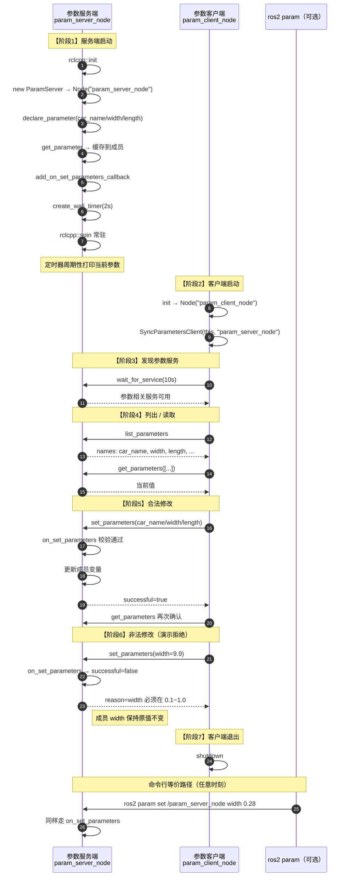

# 参数服务 从 0 到 1：完整调用过程

> 对应课程：**2.5.3 参数服务 (C++)**  
> API 详解见同目录：[`Param_API与模块详解.md`](./Param_API与模块详解.md)

对应代码：

- 参数服务端（持有参数）：`demo01_param_server.cpp`
- 参数客户端（远程读写）：`demo02_param_client.cpp`
- 目标节点名：`param_server_node`

运行：

```bash
# 终端 1：参数服务端（常驻）
ros2 run cpp04_param demo01_param_server

# 终端 2：参数客户端（跑完演示后退出）
ros2 run cpp04_param demo02_param_client

# 或不用客户端，直接命令行：
ros2 param list
ros2 param get /param_server_node car_name
ros2 param set /param_server_node width 0.30
```

---

## 0. 参数服务是什么

和 Topic / Service / Action 不同：

| | Topic | Service | Action | **参数 (Param)** |
|--|-------|---------|--------|------------------|
| 目的 | 流式数据 | 一次请求应答 | 长任务+反馈+取消 | **节点配置项的读写** |
| 谁持有数据 | 发布端发出即走 | 算完就返回 | Goal/Result | **参数在某个 Node 上长期存放** |
| 典型操作 | publish / subscribe | call | send_goal | declare / get / set / list |

一句话：

> 每个 Node 自带一套「参数服务」；本节点 `declare_parameter` 后，本进程或其它节点（`SyncParametersClient` / `ros2 param`）都能 list / get / set。

底层其实也是 ROS 服务（`~/get_parameters` 等），但业务上用 Param API，不必手写 srv。

本 demo 三个参数：

| 名 | 类型 | 默认 | 校验 |
|----|------|------|------|
| `car_name` | string | `"turtle"` | 非空 |
| `width` | double | `0.25` | `0.1 ~ 1.0` |
| `length` | double | `0.45` | `0.1 ~ 2.0` |

---

## 1. 完整时序（从启动到客户端改参）



---

## 2. 阶段拆解

### 阶段 1：服务端从 0 起来

1. `rclcpp::init`
2. 创建 `ParamServer` 节点 `param_server_node`
3. **`declare_parameter`**：登记名字、类型、默认值  
   - 不声明 → 外部 get/set 会失败或行为不符合预期
4. `get_parameter(...).as_*()` 读到成员变量
5. `add_on_set_parameters_callback`：之后任何 set（客户端或 CLI）先过这里
6. 定时器每 2s 打印，方便肉眼看改参是否生效
7. `spin` 常驻（参数服务回调 + 定时器都靠它）

### 阶段 2~3：客户端连接

```cpp
param_client_ = std::make_shared<rclcpp::SyncParametersClient>(
  this, "param_server_node");  // 远端节点名！
param_client_->wait_for_service(10s);
```

`SyncParametersClient` = 同步封装：调用时内部等待结果，写演示代码更简单。  
（还有 `AsyncParametersClient`，适合长期节点里不阻塞。）

### 阶段 4：list / get

- `list_parameters({}, 0)`：列出远端参数名  
- `get_parameters({"car_name","width","length"})`：批量取值

### 阶段 5：合法 set

客户端构造 `rclcpp::Parameter("width", 0.30)` 等，调用 `set_parameters`。  
服务端 `on_set_parameters`：

- 校验通过 → `successful=true`，更新 `car_name_/width_/length_`
- 随后定时器打印会看到新值

### 阶段 6：非法 set（Action 里的「拒绝」同类思想）

`width=9.9` 越界 → 回调返回 `successful=false` + `reason`。  
**参数不会被改掉**；客户端打印「预期中的拒绝」。

### 阶段 7：退出

- 客户端：演示完 `shutdown` 退出  
- 服务端：继续 `spin`，仍可用 `ros2 param` 操作

---

## 3. 和「普通 Service」对照

| | `cpp02_service` AddInts | `cpp04_param` |
|--|-------------------------|---------------|
| 数据寿命 | 请求来一次算一次 | 参数一直挂在节点上 |
| 自定义 srv | 要写 `AddInts.srv` | 用标准参数接口，无需自定义 srv |
| 典型 API | `create_service` / `async_send_request` | `declare_parameter` / `SyncParametersClient` |
| 校验点 | 服务回调里 | `on_set_parameters` |

---

## 4. 必须记住的 4 句话

1. **参数属于某个 Node；先 `declare`，再 get/set。**
2. **远端操作要用节点名**（本例 `param_server_node`），和话题名/服务名不是同一套。
3. **`on_set_parameters` 是闸门**：可接受也可拒绝；拒绝则值不变。
4. **服务端要 `spin`；同步客户端演示可以不长期 spin。**
