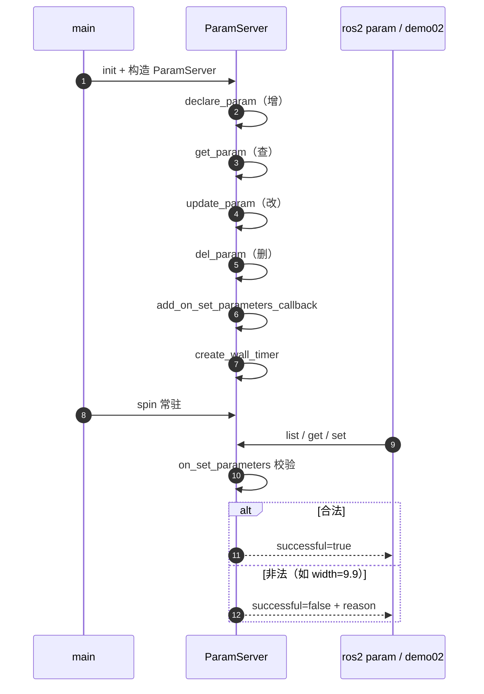
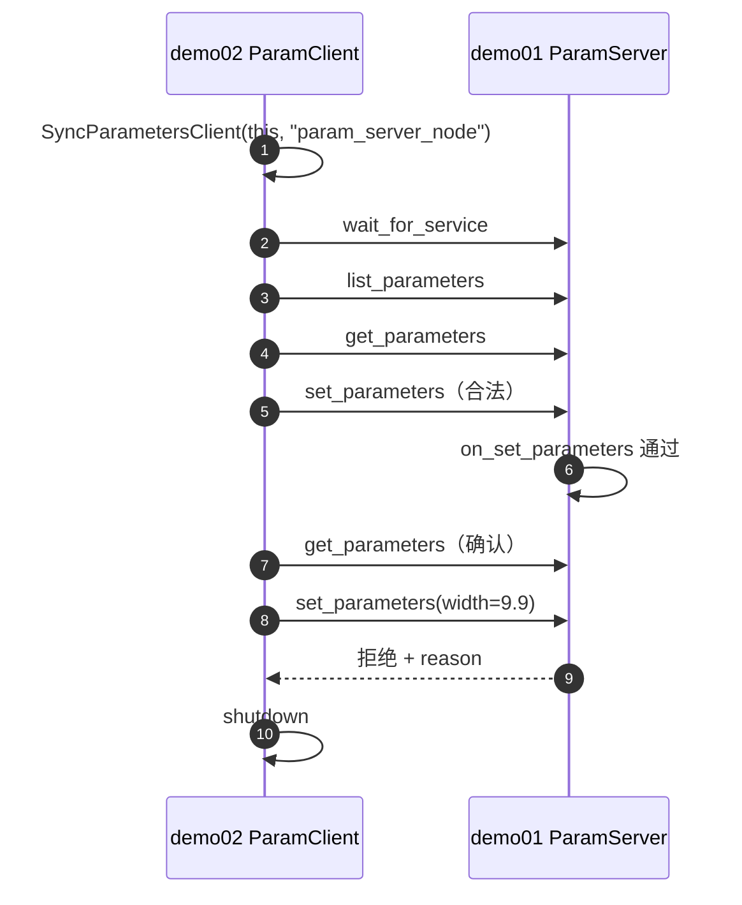

# 第 04 节 · 参数服务（C++）完整学习文档

> 包：`cpp04_param`  
> 课程：2.5.3 参数服务 (C++)  
> API 速查：[`Param_API与模块详解.md`](./Param_API与模块详解.md)

---

## 1. 本节要学会什么

参数（Parameter）用来存放**节点配置**，不是用来传传感器流数据的。

| 通信方式 | 干什么 | 数据寿命 |
|----------|--------|----------|
| Topic | 持续广播 | 发出即走 |
| Service | 一问一答 | 算完就结束 |
| Action | 长任务 + 反馈 + 取消 | 一次任务周期 |
| **Param** | **读写配置项** | **挂在某个 Node 上长期存在** |

课件要求掌握四个动作：

| 步骤 | 名字 | API |
|------|------|-----|
| 3-1 | **增** | `declare_parameter` |
| 3-2 | **查** | `get_parameter` / `has_parameter` / `list_parameters` |
| 3-3 | **改** | `set_parameter` / `set_parameters` |
| 3-4 | **删** | `undeclare_parameter` |

推荐节点写法（与课件一致）：构造函数里依次调用四个成员函数，再 `spin`。

```cpp
ParamServer() : Node("param_server_node", options) {
  declare_param();  // 增
  get_param();      // 查
  update_param();   // 改
  del_param();      // 删
}
```

---

## 2. 三个可执行文件怎么用

| 程序 | 作用 | 是否常驻 |
|------|------|----------|
| `demo00_param` | 单节点把增删改查跑一遍（入门） | 否，跑完退出 |
| `demo01_param_server` | 服务端：增删改查 + 常驻提供参数服务 | 是，`spin` |
| `demo02_param_client` | 客户端：远程 list / get / set | 否，演示完退出 |

```bash
cd ~/learning/zero-infra/ws01_plumbing
source /opt/ros/jazzy/setup.bash
source install/setup.bash

# ① 入门
ros2 run cpp04_param demo00_param

# ② 完整演示
# 终端 A
ros2 run cpp04_param demo01_param_server
# 终端 B
ros2 run cpp04_param demo02_param_client

# ③ 命令行也能操作服务端参数
ros2 param list
ros2 param get /param_server_node car_name
ros2 param set /param_server_node width 0.30
```

---

## 3. NodeOptions（课件里的坑）

```cpp
Node("param_server_node",
     rclcpp::NodeOptions().allow_undeclared_parameters(true));
```

| 选项 | 含义 |
|------|------|
| `allow_undeclared_parameters(true)` | 允许对**还没 declare** 的名字直接 `set`（会自动声明） |
| 默认 `false` | 更严格，适合正式项目 |

旧课件可能写成 `NodeOptions().all()`。在 **ROS 2 Jazzy** 请改用上面写法。

---

## 4. 服务端完整流程（demo01）



### 4.1 增 `declare_param`

登记名字、类型、默认值。不声明时（且未开 `allow_undeclared`），外部很难正确读写。

### 4.2 查 `get_param`

- `get_parameter("x").as_string()`  
- `get_parameter("w", width)`  
- `get_parameters({...})` 批量  
- `has_parameter("x")` 是否存在  

### 4.3 改 `update_param`

- 本节点：`set_parameter` / `set_parameters`  
- 远端：客户端或 `ros2 param set` → 触发 `on_set_parameters`  

### 4.4 删 `del_param`

`undeclare_parameter("tmp_flag")` 从本节点参数表移除。  
业务上真正长期用的参数一般不删；demo 用临时参数演示。

---

## 5. 客户端完整流程（demo02）



要点：

1. 第二个参数是**远端节点名** `param_server_node`，不是话题名。  
2. `SyncParametersClient` 同步等待结果，适合学习。  
3. 「删」主要在服务端 `undeclare`；客户端本节以查/改为主。

---

## 6. 多 Node 会不会抢参数？（简要）

参数挂在**某一个** Node 上。多个客户端只是调它的 get/set 服务。

| 情况 | 结论 |
|------|------|
| 服务端单线程 `spin` | 回调串行，一般**不用怕内存竞态**（类似 Redis 单线程处理命令） |
| 多客户端同时 set | **后写覆盖先写**（业务竞态），没有分布式锁 |
| `MultiThreadedExecutor` | 自有缓存要加锁，或每次 `get_parameter` |

详见下文 API 文档「并发」小节。

---

## 7. 和 Service 的差别（初学者易混）

| | `cpp02_service` | `cpp04_param` |
|--|-----------------|---------------|
| 自定义接口 | 要写 `.srv` | **不用**，标准参数接口 |
| 数据 | 请求来一次算一次 | 配置一直在节点上 |
| 典型 API | `create_service` / `async_send_request` | `declare` / `get` / `set` / `undeclare` |
| 校验位置 | 服务回调 | `on_set_parameters` |

---

## 8. 建议练习顺序

1. 跑 `demo00`，对照日志看懂增删改查。  
2. 跑 `demo01`，另开终端 `ros2 param get/set`。  
3. 跑 `demo02`，看合法改成功、非法改被拒。  
4. 自己加一个参数 `color`（string），走完增→查→改。  
5. 试着把 `width` 设成 `0.05`，确认被拒绝。

---

## 9. 一句话总结

> **第 04 节 = 在 Node 上对配置做增删改查；服务端拆四个函数演示；客户端远程查改；单线程 spin 下实现简单，多写者仍要接受 last-write-wins。**
